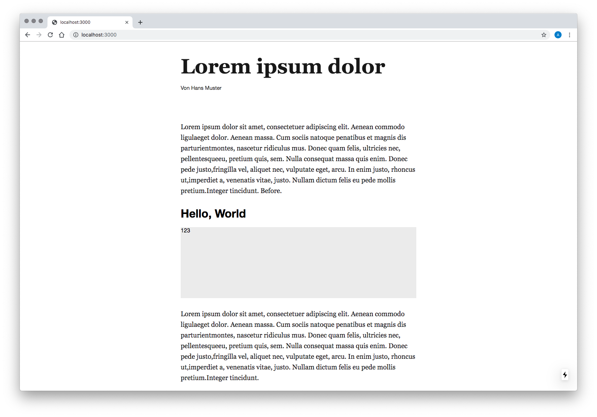

# Dynamic Component Starter Kit

**Note:** This project uses the TypeScript transpiler, but you can still write JavaScript—just put your code into `.js(x)` files.

## Getting started

 1. `npm install`
 1. Install peer dependencies of `@project-r/styleguide`, e.g. using [this script](https://gist.github.com/garamond/d6258d55478c562c3df9ff70e6a70e8b): `peerDependencies.py node_modules/@project-r/styleguide/package.json`
 1. Add `.env` file to project root

## Development

### Storybook

 1. `npm run storybook`
 1. [http://localhost:18881](http://localhost:18881)

### Article dev environment

 1. `npm run dev:code`
 1. `npm run dev:server`
1. [http://localhost:3000](http://localhost:3000)
